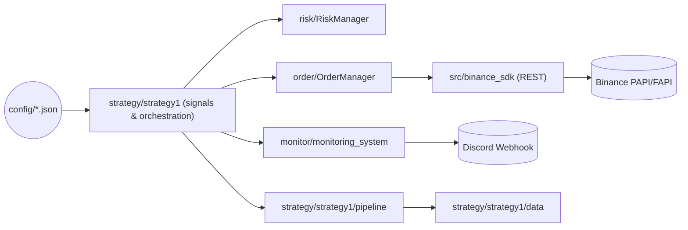

# Trading_EngineV1 – System Understanding & Refactor Notes (2026-03-06)

This document captures my current understanding of the statistical arbitrage engine that lives under `Trading_EngineV1/` and highlights the most important improvement or refactor ideas before touching any code.

## 1. Purpose & Strategy
- The live strategy (`strategy/strategy1/`) targets funding-rate or basis differentials between perpetual futures markets. Data fetchers under `strategy/strategy1/src/` collect historical funding and kline data from Binance, Bybit, and Bitget; `B2B_monitor` ranks symbols by rolling funding spreads to emit signals (`strategy/strategy1/trading_signal.py`).
- `RealTradingBot` (`strategy/strategy1/order_engine.py`) is intended to translate those signals into Binance USDⓈ-M futures orders, enforce a $50 notional cap, and respect tick-size constraints via `order/OrderManager`.
- Operational telemetry flows through Discord webhooks via `monitor/discord_notifier.py`, while `monitor/monitoring_system.py` couples a `PositionMonitor` thread with basic performance tracking persisted in `monitor/performance_data.json`.

## 2. Architecture At A Glance

Two largely independent paths co-exist: (1) the *research/data* path (`strategy/strategy1/src`, `pipeline/`) that prepares statistical inputs and (2) the *execution* path (strategy entry point → risk/order → exchange → monitoring).

## 3. Module Inventory & Responsibilities
| Layer | Key Modules | Notes |
| --- | --- | --- |
| Exchange SDK | `src/binance_sdk.py`, `websocket/binance_websocket.py` | REST wrapper for portfolio-margin endpoints; websocket stub duplicates logic. |
| Strategy & Signals | `strategy/strategy1/B2B.py`, `trading_signal.py`, `main.py` | Produces ranked funding spreads, then calls `RealTradingBot` entrypoints for execution & Discord reporting. |
| Order Execution | `order/order.py`, `strategy/strategy1/order_engine.py` | Tick-size aware limit/market order helpers, quantity sizing, monitoring of fills. |
| Risk | `risk/risks.py` | Intended to summarize account state and enforce guardrails prior to execution. |
| Monitoring | `monitor/` package | Discord notifier, position monitor thread, performance log persisted as JSON. |
| Utilities | `util/config_manager.py`, `util/utils.py` | Centralized config loading, logging, math helpers. |
| Tests | `tests/*.py` | Mix of offline unit tests (`test_order_manager.py`, `test_utils.py`) and live-integration scripts (`test_real_trading.py`). |

## 4. How Things Currently Run
1. **Configuration** – Secrets and runtime knobs live in JSON (`config/api.json`, `config/strategy1/strategy1.json`). `ConfigManager` auto-detects project root and caches parsed configs.
2. **Signal Generation** – `B2B_monitor` loads recent funding data through fetchers derived from `strategy/strategy1/src/adapters`. Transforms happen via `pipeline/Loader.py` to compute normalized hourly rates and merges volumes for cross-exchange comparisons.
3. **Decision Layer** – `TradingSignal` exposes `get_trading_signal()` and persists ranked outputs (funding spreads, thresholds, selected symbols) into `strategy/strategy1/result.json` for the executor.
4. **Execution** – `RealTradingBot` loads configs, instantiates `BinanceFuturesClient`, queries order books, and delegates price selection to `OrderManager.calculate_limit_price()`. Risk gating is limited to a $50 notional cap and uses ad-hoc checks instead of the dedicated `RiskManager`.
5. **Monitoring & Alerting** – `monitoring_system.py` spawns a polling thread (`PositionMonitor`) against Binance REST, pipes trade completions to `PerformanceMonitor`, and forwards status embeds to Discord using synchronous HTTP posts. The strategy entry point (`strategy/strategy1/main.py`) also emits account/balance snapshots to Discord on start.
6. **Testing** – `pytest` covers mechanics such as tick-size rounding and OrderManager math, but several scripts under `tests/` (e.g., `test_real_trading.py`, `test_risk_manager_integration.py`) reach real Binance endpoints and would execute trades if keys are live.

## 5. Observations & Concerns
- **Configuration drift** – `RealTradingBot.initialize_client()` still expects nested `self.api_config['binance']` even though `load_configuration()` already filters by exchange, resulting in an empty config dict at runtime.
- **Secrets in source** – `strategy/strategy1/main.py` embeds a live Discord webhook URL in the repo. This should move to `config/strategy1/strategy1.json` or environment variables immediately.
- **RiskManager incomplete** – `risk/risks.py` references `get_margin_ratio()`, `get_utilization_ratio()`, `get_available_margin_ratio()`, and `is_at_risk()` but these methods are not implemented, so any caller of `get_risk_summary()` or `get_accounts_summary()` will raise `AttributeError`.
- **Tight coupling between layers** – Strategy orchestration, execution, and monitoring all instantiate clients, load configs, and talk to Discord independently, making it difficult to swap strategies or run dry tests.
- **Live-network “tests”** – Several files in `tests/` are effectively operational scripts that will place live orders or pull private account data. They bypass mocks and should be relocated (or guarded) to prevent accidental execution during CI.
- **Duplication of Binance clients** – `websocket/binance_websocket.py` duplicates much of `src/binance_sdk.py` but only exposes read-only endpoints. A shared transport/session layer would reduce code drift and enable rate-limit/backoff policies in one place.
- **Synchronous monitoring** – Discord notifications, data fetchers, and the monitoring loop are all blocking HTTP calls with minimal error handling; missed posts or API slowdowns can stall the trading loop.

## 6. Suggested Improvements & Refactors
### Immediate (safety / correctness)
1. **Fix configuration loading in `RealTradingBot`** so `self.api_config` already matches the exchange schema instead of calling `.get("binance")` again.
2. **Remove hard-coded secrets** (`strategy/strategy1/main.py`) and route webhook/API tokens exclusively through `ConfigManager` + environment overrides.
3. **Implement the missing `RiskManager` methods** (margin/utilization/alerts) and integrate them before every order placement to avoid blind leverage.
4. **Fence live-network tests** by moving them into a `manual/` folder or requiring an explicit flag (e.g., `if os.environ.get("ENABLE_LIVE_TRADING") != "1": skip`).

### Near-term (design & maintainability)
1. **Separate orchestration from the strategy package**: create a thin CLI (e.g., `trade.py`) that wires `TradingSignal`, `RiskManager`, and `RealTradingBot`, so strategies remain importable without side effects.
2. **Introduce an ExchangeGateway abstraction** that encapsulates REST/websocket clients plus rate-limit/retry policy; both `OrderManager` and the monitoring stack can depend on it instead of reaching into `BinanceFuturesClient` directly.
3. **Consolidate Discord messaging**: expose a single notifier service that formats embeds and rate-limits posts (monitor vs. strategy vs. tests currently all instantiate their own `DiscordNotifier`).
4. **Strengthen configuration schemas** via `pydantic` or `dataclasses` to validate thresholds, leverage caps, and default symbols at load time.

### Longer-term (scalability)
1. **Event-driven monitoring** – replace the polling loop with websocket subscriptions (Binance user data stream) so fills, balance changes, and risk alerts are near-real-time without hitting REST constantly.
2. **Backtest & paper-trade harness** – decouple exchange access through an interface that can be backed by historical funding/price data, enabling CI-safe regression tests for the stat-arb strategy.
3. **Stateful risk service** – move risk calculations into a dedicated module that persists metrics, produces structured alerts, and can be queried by both the strategy and monitoring components.
4. **Data pipeline hardening** – wrap the `pipeline/Loader.py` concurrency + file I/O in idempotent jobs with checksums so re-runs don't corrupt shared `data/` artifacts; consider storing normalized data in a database or parquet store instead of JSON/CSV scattered on disk.

## 7. Next Questions
- Define the exact execution cadence (continuous vs. scheduled) so we can plan orchestration.
- Clarify which exchanges must be supported beyond Binance and whether cross-exchange hedging is mandatory in v1.
- Confirm acceptable dependencies (async frameworks, databases) before sketching a more modular runtime.

Once these high-priority fixes and design decisions are settled, we can start refactoring with confidence.
